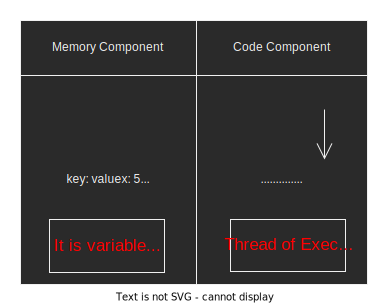
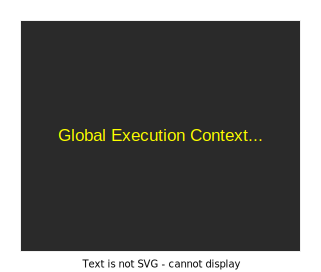
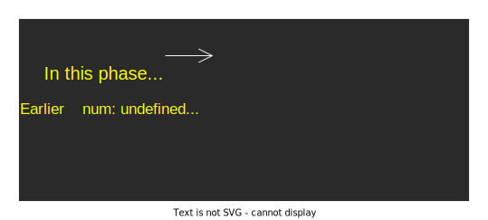
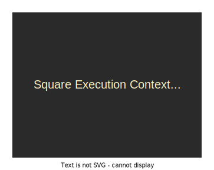

# Execution Context and Callstack in JavaScript

Everything happens in JavaScript inside the **execution context**. <br> 
Each execution context has **2 components**: 
* Memory Component (Variable Environment)
* Code Component (Thread of Execution)

Each execution context has **2 phases** also:
* Memory Creation Phase
* Execution Phase

> In **Memory Creation Phase**, variables and function are declared and stored as key-value pairs in the memory component.

> In **Execution Phase**, code is executed line by line in code component

<p align="center">
    
</p>

There are **2 types** of Execution Context:
1. **Global Execution Context** - gets created whenever program starts running
2. **Function Execution Context** - gets created whenever any function is invoked

## Global Execution Context

This is first execution context created whenever we run the code. <br>
There can only be one **GEC** 

> In the memory creation phase of **GEC** (**GEC** is Global Execution Context) inside the memory component, the JavaScript Engine will:
* Create a global object
* Create a this object
* Set up memory space for variables and functions
* Assign variables a default value of undefined and function declaration stored as key-value pairs.

`Note:` In the browser, the global object would be window and In node.js environment, the global object would be global. <br>
For Example: <br>

```JavaScript
var num = 10; 
function square(num) {
    var result = num * num;
    return result;
}
var ans = square(num);
console.log(ans); // 100
```

## Memory Creation Phase of GEC for above example

<p align="center">
    
</p>

**Points to be noticed here:**
1. window object is created.
2. this which is GEC to window object (browser environment) created.
3. num and ans assigned a default value of undefined.
4. Any function declaration (square) placed into memory.

In execution phase of GEC in memory component, the JS Engine starts executing code line by line. <br>

<p align="center">
    
</p>

## Function Execution Context (FEC)

> Execution context is created only 2 times throughtout lifecycle of program. 

> Once, When JS starts executing code that is global execution context.

> And another when we invoke a function that is function execution context.

> Similar to Global Execution Context the following thing happens in FEC with on Exception.

**In memory creation phase of FEC, JS will**
* create an arguement object instead of global object.
* create this object whose value depends on what context is a function. 
* set uup memory space for variables and functions.
* Assign the variables a default value of undefined and place any function code as key-value pair.

`Note:` **Arrow functions** don't get their own arguments and this object. They use closest surrounding function's arguement and this object. <br>

<p align="center">
    
</p>

<p align="center">Fig: Memory Creation Phase</p>

* this object is created whose value depends on which context the function was called (window object)
* arguement object get created
* num is assigned the value that is been passed as parameter to square function that is 10
* result will contain undefined

In Execution phase, `result: 100` which is calcuulate after executing line 3.

## Callstack

**Callstack** maintains order of execution of execution contexts. JavaScript can only execute one command at a line in a order. The order of execution is maintained by callstack. <br>
So, 
* When program starts running the global execution context is created and pushed onto stack
* When square function invoked, a function execution context is created and pushed onto stack
* Once square function is done executing, it returns result and control of program where function was originally invoked
* After this, square function popped off from stack
* Once last line of code finished executing, the global execution context popped off from stack.

The callstack becomes empty.


