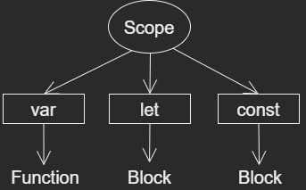
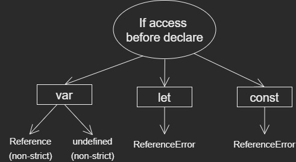

# How `var`, `let` and `const` keywords works in JavaScript

Earlier, pre-ES6 era, only __var__ keyword was introduced for declaration of variable. <br>
With ES6, the __let__ and __const__ keyword introduced.

## How to declare variables in JavaScript
> without keywords, It is same as __var__ and not allowed in __'strict'__ mode.

```JavaScript
// without keyword
name = 'Jack';

// using var
var price = 100;

// using let 
let isPermanent = false;

// using const 
const publication = 'Article';

console.log(name, price, isPermanent, publication); // Jack 100 false Article
```

__We will discuss:__
* Scope
* Reassigning new value
* When you access a variable before declaring it

## Variable Scope in JavaScript

The variable may exist in a __block__, __inside function__ or __outside function__. <br>

A `block` is section of code inside { } <br>

```JavaScript
// It has Block Scope
{
    let name = 'John Kabir';
}
```
A function is a bunch of code you want to place logically together. <br>
It is declared using __function__ keyword.

```JavaScript
// It has Function Scope
function test() {
    let name = 'Tahsan';
}
```
Everything declared outside of block and function is __global Scope__.<br>

```JavaScript
// It has Global Scope
const skyColor = 'blue';

{
    console.log(skyColor); // blue
}

function printSkyColor() {
    console.log(skyColor); // blue
}
printSkyColor();
```

So, there are three types of Scope:
1. Block Scope
2. Function Scope
3. Global Scope

The three keyword __var__, __let__ and __const__ work around these scopes.

## How to use JavaScript Variable in Global Scope

We can use __var__, __let__ and __const__ to declare global variable. But it is recommended not to do it. By doing this, variable are accessible everywhere. <br>
So to restrict scope of variable using __var__, __let__ and __const__ keywords, here's order of accessibility in scope starting with lowest:

* `var`: The functional Scope level
* `let`: The Block Scope level
* `const`: The Block Scope level

<!--  -->

<p align="center">
  
</p>

## How to Reassign a new value to variable in JavaScript

You can reassign __var__ or __let__ variables, but you can't reassign a new value to __const__ variable. <br>
`(const = constant)` <br>

**One Tricky part** <br>

When object is declared and assigned value with const, you can still change value of its properties. <br>

But you can not reassign any object value to same variable.

## When you access a variable before declaring

With var in __non-strict mode__, the variable will have an undefined value. <br>
This means variable declared but not assigned. <br>

In __strict mode__, you will get ReferenceError that variable is not declared. <br>
With let and const, you will always get ReferenceError.

<p align="center">
  
</p>

**Some Tips:**
* Don't use __var__
* Use __let__ or __const__ 
* Use __const__ more often 
* Use __let__, when you need to reassign

